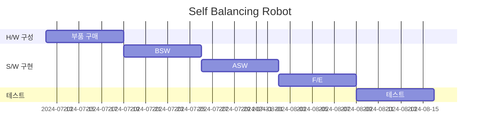
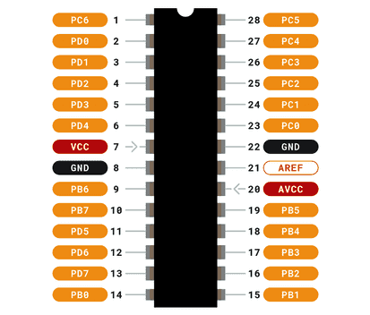

# 밸런싱 로봇

- [밸런싱 로봇](#밸런싱-로봇)
  - [개발 일정](#개발-일정)
  - [개발 도구](#개발-도구)
  - [H/W 구성도](#hw-구성도)
  - [HSI (Human-System Interface)](#hsi-human-system-interface)
  - [아키텍처](#아키텍처)
  - [ERD](#erd)
  - [BOM](#bom)

## 개발 일정

> [What Is AUTOSAR?](https://autosartutorials.com/what-is-autosar/)

## 개발 도구

|        구분        |         내용          |
|:----------------:|:-------------------:|
|     Doxygen      |     코드 아키텍처 분석      |
| Microchip Studio |     MCU IDE 개발      |
|      Github      |    코드 버전 및 형상 관리    |
|      KICAD       | 회로도 및 PCB Layout 설계 |
|    Fusion 360    |       3D 모델링        |

## H/W 구성도

![[밸런싱로봇] 하드웨어_구성도.png](documents%2F%5B%EB%B0%B8%EB%9F%B0%EC%8B%B1%EB%A1%9C%EB%B4%87%5D%20%ED%95%98%EB%93%9C%EC%9B%A8%EC%96%B4_%EA%B5%AC%EC%84%B1%EB%8F%84.png)

## HSI (Human-System Interface)

## 아키텍처

## ERD

## BOM

↗️ [[밸런싱로봇] BOM.csv](documents%2F%5B%EB%B0%B8%EB%9F%B0%EC%8B%B1%EB%A1%9C%EB%B4%87%5D%20BOM.csv)

| 상품번호    | 상품명                                          | 링크                                                         | 패키지 | 라벨 | 제조사     | 단가 (단위:원) | BOM 수량 | 소계 (단위:원) |
|---------|----------------------------------------------|------------------------------------------------------------|-----|----|---------|-----------|--------|-----------|
| 34404   | Arduino Uno (R3)                             | [Link](https://www.devicemart.co.kr/goods/view?no=34404)   |     |    | Arduino | 29,000    | 1      | 29,000    |
| 1278835 | 2A L298 모터드라이버 모듈 (아두이노 호환) [SZH-EK001]      | [Link](https://www.devicemart.co.kr/goods/view?no=1278835) |     |    | SMG     | 1,800     | 1      | 1,800     |
| 1278220 | 블루투스 직렬포트 모듈 HC-06 (DIP) [SZH-EK010]         | [Link](https://www.devicemart.co.kr/goods/view?no=1278220) |     |    | OEM     | 6,000     | 1      | 6,000     |
| 1247052 | MPU-6050 6축 자이로 가속도 센서 모듈 GY-521 [SZH-EK007] | [Link](https://www.devicemart.co.kr/goods/view?no=1247052) |     |    | OEM     | 2,200     | 1      | 2,200     |
| 3090    | AA배터리 건전지홀더 2선 전원타입[8개입]                     | [Link](https://www.devicemart.co.kr/goods/view?no=3090)    |     |    | SMG-A   | 1,800     | 1      | 1,800     |
| 1329802 | 기어드DC모터 타이어세트 [SZH-GNP194]                   | [Link](https://www.devicemart.co.kr/goods/view?no=1329802) |     |    | SMG     | 23,600    | 2      | 47,200    |
