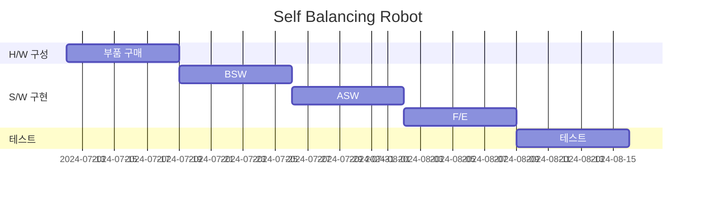
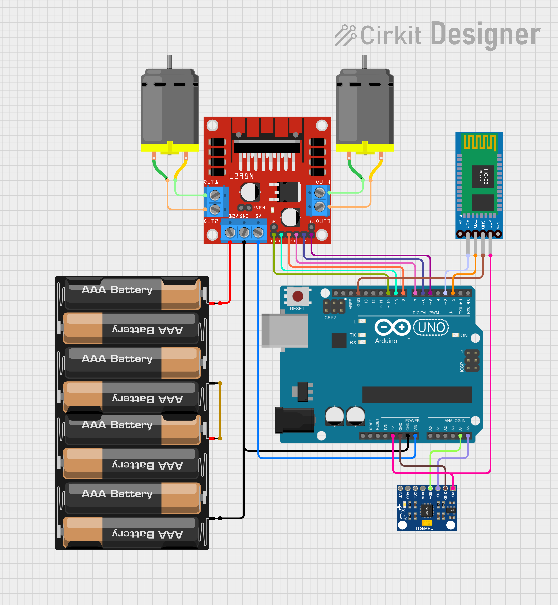
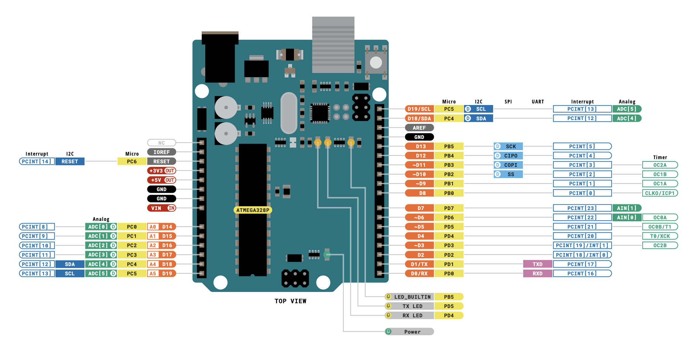

# 밸런싱 로봇

- [밸런싱 로봇](#밸런싱-로봇)
  - [개발 일정](#개발-일정)
  - [개발 도구](#개발-도구)
  - [H/W 구성도](#hw-구성도)
  - [HSI (Human-System Interface)](#hsi-human-system-interface)
  - [아키텍처](#아키텍처)
  - [ERD](#erd)
  - [BOM](#bom)

## 개발 일정

> [What Is AUTOSAR?](https://autosartutorials.com/what-is-autosar/)

## 개발 도구

|        구분        |         내용          |
|:----------------:|:-------------------:|
|     Doxygen      |     코드 아키텍처 분석      |
| Microchip Studio |     MCU IDE 개발      |
|      Github      |    코드 버전 및 형상 관리    |
|      KICAD       | 회로도 및 PCB Layout 설계 |
|    Fusion 360    |       3D 모델링        |

## H/W 구성도

## HSI (Human-System Interface)

| No. | Name |      Func1       |   Func2   |  Func3  | Func4 | Func5  |     Used      |
|:---:|:----:|:----------------:|:---------:|:-------:|:-----:|:------:|:-------------:|
| 14  | PB0  |     PCINT[0]     | CLKO/ICP1 |         |       |        |    IN2(DC)    |
| 15  | PB1  |     PCINT[1]     |   OC1A    |         |       |        |    IN1(DC)    |
| 16  | PB2  |     PCINT[2]     |   OC1B    | SS(SPI) |       |        |    ENA(DC)    |
|  4  | PD2  | PCINT[18]/INT[0] |           |         |       |        |    TXD(BT)    |
|  5  | PD3  | PCINT[19]/INT[1] |   OC2B    |         |       |        |    RXD(BT)    |
|  6  | PD4  |    PCINT[20]     |  T0 /XCK  |         |       |        | KEY EN(BT) |
| 11  | PD5  |    PCINT[21]     |  OC0B/T1  |         |       |        |    ENB(DC)    |
| 12  | PD6  |    PCINT[22]     |   OC0A    |         |       | AIN[0] |    IN4(DC)    |
| 13  | PD7  |    PCINT[23]     |           |         |       | AIN[1] |    IN3(DC)    |

## 아키텍처

## ERD

## BOM