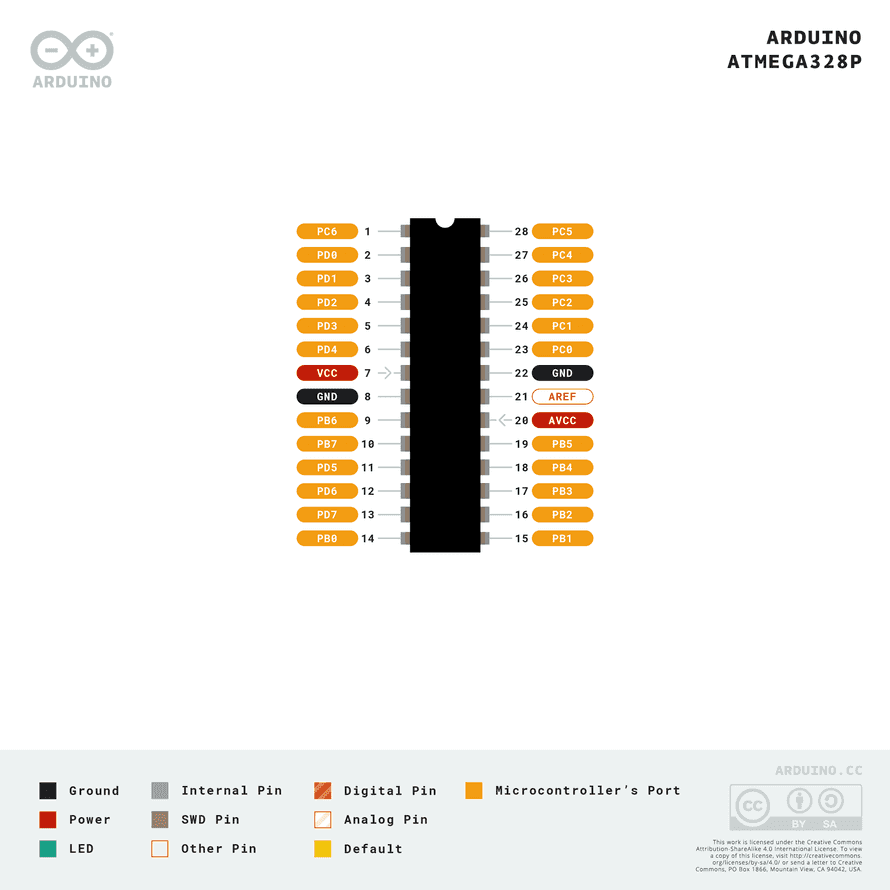

# 밸런싱 로봇

- [밸런싱 로봇](#밸런싱-로봇)
  - [개발 일정](#개발-일정)
  - [개발 도구](#개발-도구)
  - [H/W 구성도](#hw-구성도)
  - [HSI (Human-System Interface)](#hsi-human-system-interface)
  - [아키텍처](#아키텍처)
  - [ERD](#erd)
  - [BOM](#bom)

## 개발 일정

> [What Is AUTOSAR?](https://autosartutorials.com/what-is-autosar/)

## 개발 도구

|        구분        |         내용          |
|:----------------:|:-------------------:|
|     Doxygen      |     코드 아키텍처 분석      |
| Microchip Studio |     MCU IDE 개발      |
|      Github      |    코드 버전 및 형상 관리    |
|      KICAD       | 회로도 및 PCB Layout 설계 |
|    Fusion 360    |       3D 모델링        |

## H/W 구성도

|  Component  | Description                                               |                                                                     Pins                                                                     
|:-----------:|:----------------------------------------------------------|:--------------------------------------------------------------------------------------------------------------------------------------------:|
| Arduino UNO | Microcontroller board                                     | UNUSED, IOREF, Reset, 3.3V, 5V, GND, Vin, A0, A1, A2, A3, A4, A5, SCL, SDA, AREF, D13, D12, D11, D10, D9, D8, D7, D6, D5, D4, D3, D2, D1, D0 |
|    L298N    | Controls the direction and speed of DC motors             |                OUT1, OUT2, 12V, GND, 5V, OUT3, OUT4, 5V-ENA-JMP-I, 5V-ENA-JMP-O, +5V-J1, +5V-J2, ENA, IN1, IN2, IN3, IN4, ENB                |
|  DC Motor   | Converts electrical energy into mechanical energy         |                                                                    P1, P2                                                                    |
|    HC-06    | Bluetooth module for wireless communication               |                                                              VCC, GND, TXD, RXD                                                              |
|   MPU6050   | Motion tracking device with a gyroscope and accelerometer |                                                    VCC, GND, SCL, SDA, XDA, XCL, AD0, INT                                                    |

|   From   | Pin |     To      | Pin  |
|:--------:|:---:|:-----------:|:----:|
| DC Motor | P1  |    L298N    | OUT2 |
| DC Motor | P2  |    L298N    | OUT1 |
| DC Motor | P1  |    L298N    | OUT4 |
| DC Motor | P2  |    L298N    | OUT3 |
|  L298N   | 5V  | Arduino UNO | Vin  |
|  L298N   | ENA | Arduino UNO | D10  |
|  L298N   | IN1 | Arduino UNO |  D9  |
|  L298N   | IN2 | Arduino UNO |  D8  |
|  L298N   | IN3 | Arduino UNO |  D7  |
|  L298N   | IN4 | Arduino UNO |  D6  |
|  L298N   | ENB | Arduino UNO |  D5  |
|  HC-06   | VCC | Arduino UNO |  5V  |
|  HC-06   | GND | Arduino UNO | GND  |
|  HC-06   | TXD | Arduino UNO |  D2  |
|  HC-06   | RXD | Arduino UNO |  D3  |
| MPU6050  | VCC | Arduino UNO |  5V  |
| MPU6050  | GND | Arduino UNO | GND  |
| MPU6050  | SCL | Arduino UNO |  A5  |
| MPU6050  | SDA | Arduino UNO |  A4  |

## HSI (Human-System Interface)

## 아키텍처

## ERD

## BOM